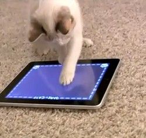

# PawJS



> Paw simulates touches and touch gestures including taps, holds, swipes,
> pinches, and custom gestures. It comes with a touch recorder that can record
> your interactions and emit javascript code that you can load right into Paw
> to play your custom recorded gestures.
>
> This is great for automated testing of these interactions in a repeatable
> way, especially on mobile.

## Install using bower

```bash
# install bower if you haven't already
$ npm install -g bower

# install this package
$ bower install git@github.com:Workiva/paw.git
```

### If you are using RequireJS
- In your requirejs configuration, ensure the following config exists:

```javascript
requirejs.config({
    paths: {
        'paw': 'bower_components/paw/src/'
    }
});
```
### If you want to use the Paw Gesture Recorder in your project
- Install paw as an npm dev dependency
- run the paw-record script

```
npm install paw --save-dev
./node_modules/.bin/paw-record # starts the recorder
```
> Protip: Add ./node_modules/.bin to your path to be able to run `paw-record` without specifying the path

## Try the demos
```
cd paw
npm install
bower install
grunt serve
```

## Usage / Examples

Paw is wrapped using the universal module definition pattern so it can used by
either AMD or CommonJS module loaders or just included into a page via a script
tag. Once you've constructed a new Paw you can start chaining calls to gestures.
All calls are sequenced internally so you can write nice fluent style code like
this:

```javascript
var paw = new Paw();

// Taps at 100x100, then waits for 1 second, then swipes diagonally. 
// The swipe takes 1 second
// You can also sequence in any function, in this case we love kool-aid.

paw.tap('100px 100px')
   .wait(1000)
   .swipe('top left', 'bottom right' )
   .then(function() { alert('oh yeah!'); })

// Tap on a matching DOM element
paw.tap('#myBtnId');
// same as
paw.tap(document.getElementById('myBtnId'));
// same as
// Tap on a jQuery selector (FYI Paw does not depend on jQuery)
paw.tap( $('#myBtnId') );

// You can add custom gestures to Paw

var customGestures = {
  downUp: function(done) {
    this
    .touch('50% 20%')
    .wait(40)
    .drag('50% 40%')
    .wait(40)
    .drag('50% 20%')
    .wait(40)
    .release()
    .then(done);
}
var paw = new Paw(customGestures);
paw.downUp(); // runs your custom gesture
```

## Project Structure

- `bower_components` libraries distributed by [Bower][Bower]
- `docs` project design and API documentation
- `node_modules` libraries distributed by [NPM][NPM]
- `out` output from build tasks
- `src` source files
- `test` test files
- `tools` supporting tools for code quality, builds, etc.

## Development: Process

This project uses [wf-grunt](https://github.com/WebFilings/wf-grunt#tasks)
for building.

## Credit

Credit goes to [faketouches](https://github.com/jtangelder/faketouches.js)
which inspired this code.

[Node]: http://nodejs.org/api/
[NPM]: https://npmjs.org/
[Bower]: http://bower.io/
